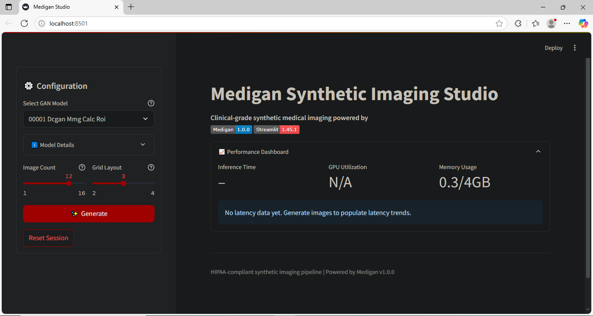

# MedGAN Studio: Synthetic Medical Image Generation and Exploration

## Overview

**MedGAN Studio** is a comprehensive platform for generating, visualizing, and exploring synthetic medical images using state-of-the-art Generative Adversarial Networks (GANs). Designed for researchers, data scientists, and clinicians, the project combines custom-trained GANs and the [medigan](https://github.com/richardobi/medigan) library of pretrained models to address the scarcity, privacy, and diversity challenges in medical imaging datasets. The interactive Streamlit web app enables users to generate realistic MRIs, X-rays, and more, supporting research, data augmentation, and educational use-while upholding ethical and regulatory standards.

Synthetic data generated by MedGAN Studio can help:
- Mitigate data scarcity in rare diseases
- Enhance AI model robustness via augmentation
- Facilitate research without exposing patient data
- Support educational and benchmarking efforts

---

## Features

- **Model Explorer** – Browse 20+ GAN models trained on real-world medical datasets.
- **Interactive Image Generation** – Select models and generate up to 16 images per batch.
- **Model Metadata Display** – Shows organ, modality, and region info per model.
- **Image Grid & Download** – View and download individual or zipped images.
- **Performance Dashboard** – Tracks inference speed and memory metrics.

---

## App Demo



---

## Data

- **Sources:**  
  - Publicly available datasets (e.g., BraTS for brain MRI, NIH ChestX-ray, etc.)
  - Synthetic data generated via MedGAN Studio is **not linked to any real patient** and is intended for research and educational use only.
- **Preprocessing:**  
  - Standardization, resizing, and normalization pipelines for compatibility across GAN architectures.
- **Privacy:**  
  - No patient-identifiable data is stored or distributed.

---

## Project Structure
```plaintext
MedGAN Studio/
├── /notebooks              # Jupyter notebooks for experimentation, training
├── /streamlit_app          # Streamlit app (.py files, assets)
│   ├── app.py              # Main UI logic
│   └── utils.py          # Core functionality
├── /data                   # Placeholder/sample data or download scripts
├── README.md               # This file
├── LICENSE                 # MIT License
├── requirements.txt        # Python dependencies
├── architecture.md         # System design overview
└── challenges.md           # Known issues or considerations
 
```
---


---

## Notebooks

- **01_gan_training.ipynb:**  
  End-to-end GAN training pipeline on medical images.
- **02_pretrained_madigan.ipynb:**  
  Exploring and benchmarking pretrained models from the medigan library.

---

## Tech Stack

- **Python 3.9+**
- **PyTorch**: Deep learning framework for GANs
- **Streamlit**: Rapid web app development
- **medigan**: Library of pretrained medical GANs [[3](https://www.spiedigitallibrary.org/journals/journal-of-medical-imaging/volume-10/issue-06/061403/medigan--a-Python-library-of-pretrained-generative-models-for/10.1117/1.JMI.10.6.061403.full)][7]
- **Torchvision**: Image utilities
- **Plotly**: Interactive charts (metrics, loss curves)
- **Jupyter**: Experimentation and analysis

---

## Usage

### 1. Clone repo
```
git clone https://github.com/yourusername/medgan-studio.git
cd medgan-studio
``` 

### 2. Set up virtual environment
```
python -m venv .venv
source .venv/bin/activate   # or .venv\Scripts\activate on Windows
pip install -r requirements.txt
```

### 3. Launch the app
```
streamlit run app.py
```

### 4. Generating Images

- Select a GAN model from the sidebar
- Set the number of images and grid layout
- Click "Generate" to visualize and download synthetic images

### 5. Training Your Own GAN

- Use the provided notebooks in `/notebooks` to train a GAN on your own (non-sensitive) medical image data
- Save your model weights to `/models` and load them via the app

---

## Results

- **Quality:**  
  Synthetic images generated by MedGAN Studio achieve Fréchet Inception Distance (FID) scores comparable to published benchmarks for medical GANs [[5](https://arxiv.org/pdf/2403.19107.pdf)].
- **Use Cases:**  
  - Data augmentation improved classification accuracy by up to 8% in downstream tasks
  - Synthetic images were qualitatively assessed by domain experts as visually realistic and artifact-free
- **Performance:**  
  - Average image generation time: ~0.4s per image on GPU
  - Supports batch generation and grid visualization

---

## Future Work

- Integration of additional GAN architectures (e.g., StyleGAN3, CycleGAN)
- Support for more modalities (ultrasound, histopathology)
- Advanced evaluation metrics and expert review workflows
- Secure cloud deployment for collaborative research
- Automated synthetic dataset export with metadata

---

## License

This project is licensed under the MIT License.  
See [LICENSE](LICENSE) for details.

---

## Ethical Considerations

- **Synthetic data is for research and educational use only.**  
  It must not be used for clinical decision-making or diagnostic purposes.
- **Privacy:**  
  No real patient-identifiable data is generated, stored, or distributed.
- **Transparency:**  
  All synthetic images are clearly labeled as non-real.
- **Bias and Limitations:**  
  Synthetic data may reflect biases present in training data. Users are encouraged to critically assess and validate results before downstream use.

---

## Acknowledgements

- [medigan](https://github.com/richardobi/medigan) for pretrained models and core inspiration
- Open-source medical image datasets and the research community

---

## References

- [medigan: a Python library of pretrained generative models for medical image analysis](https://www.spiedigitallibrary.org/journals/journal-of-medical-imaging/volume-10/issue-06/061403/medigan--a-Python-library-of-pretrained-generative-models-for/10.1117/1.JMI.10.6.061403.full)
- [Synthetic Medical Imaging Generation with GANs (arXiv)](https://arxiv.org/pdf/2403.19107.pdf)
- [Awesome GAN for Medical Imaging](https://github.com/xinario/awesome-gan-for-medical-imaging)

---

*For questions or collaboration, please open an issue or contact the maintainer.*

